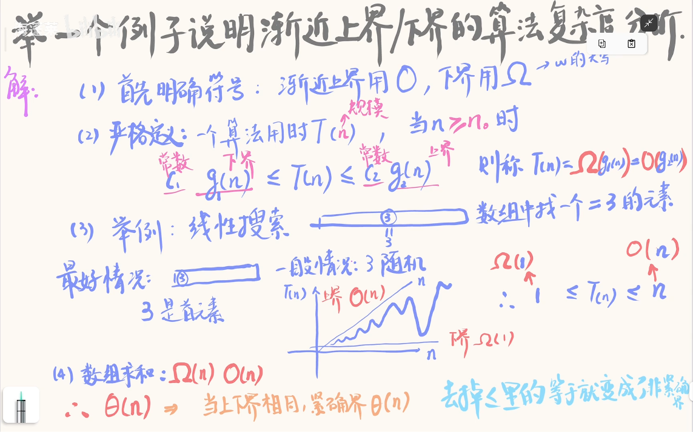

# 计算机算法设计与分析

## 考试形式：开卷。简答+大题

- **零基础救急速成方案**：首先去b站看视频：https://www.bilibili.com/video/BV1JmG767Etk

里面有笔记+PPT+往年考题讲解，优先级：往年考题>笔记>PPT，时间特别紧可以不看PPT，因为PPT内容被笔记全覆盖了。

- **考场救急方案**，打印根目录下的PDF，包括：
  - [PPT缩印版.pdf](./PPT缩印版.pdf)，只有43页，双面打印只需要22页，非常适合快速查找。
  - [笔记打印版.pdf](./笔记打印版.pdf)

[TOC]

- **阅读GitHub笔记**：笔记打印版.pdf的内容如下，可以对着b站浏览：

### 第一章：绪论

### 第二章：排序算法

### 第三章：分治算法

### 第四章：数据集合上的搜索算法

### 第五章：贪心算法

### 第七章：动态规划

### 第八章：回溯与分支限界技术

### 第九章：计算机难解问题与NP-完全性
